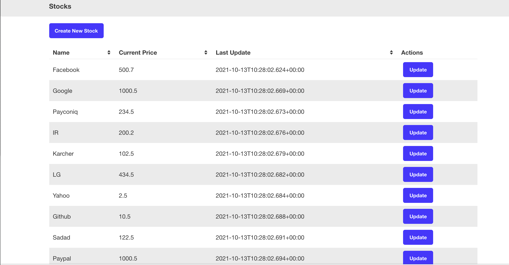

# 📈 Stock Management App

A full-stack CRUD application for managing stock portfolios, built with **Spring Boot 3** and **React 18**.



---

## ✨ Features

- **View** all stocks in a clean, sortable table — including soft-deleted entries
- **Create** new stocks with real-time duplicate name validation
- **Edit** stock name and price via an inline modal
- **Soft Delete** — marks a stock as deleted without removing it from the database
- **Undo Delete** — restore any deleted stock directly from the list with one click
- **Swagger UI** for interactive API exploration

---

## 🛠 Tech Stack

| Layer    | Technology                                        |
|----------|---------------------------------------------------|
| Backend  | Spring Boot 3, Spring Data JPA, H2 (in-memory DB) |
| Frontend | React 18, Redux, Tailwind CSS, Axios              |
| Tooling  | Maven, Create React App, Docker Compose           |

---

## 🚀 Getting Started

### Prerequisites

- Java 17+
- Node.js 18+
- Docker *(optional)*

---

### Option 1 — Docker Compose *(recommended)*

```bash
docker-compose up
```

| Service  | URL                          |
|----------|------------------------------|
| Frontend | http://localhost:5000         |
| Backend  | http://localhost:8080         |

---

### Option 2 — Run Locally

**Backend**

```bash
cd stock-mvc-api
./mvnw spring-boot:run
```

**Frontend**

```bash
cd stock-ui
npm install
npm start
```

| Service  | URL                          |
|----------|------------------------------|
| Frontend | http://localhost:3000         |
| Backend  | http://localhost:8080         |
| Swagger  | http://localhost:8080/swagger-ui.html |

---

## 📡 API Reference

Base URL: `http://localhost:8080/api`

| Method   | Endpoint               | Description                        |
|----------|------------------------|------------------------------------|
| `GET`    | `/stocks/`             | List all stocks (including deleted)|
| `POST`   | `/stocks/`             | Create a stock (unique name)       |
| `PUT`    | `/stocks/{id}`         | Update name and price              |
| `DELETE` | `/stocks/{id}`         | Soft delete a stock                |
| `PATCH`  | `/stocks/{id}/restore` | Restore a soft-deleted stock       |

> Deleted stocks remain in the database with `deleted = true` and are excluded from business logic (create/update uniqueness checks) but visible in the list UI.

---

## 🗂 Project Structure

```
stock/
├── stock-mvc-api/                          # Spring Boot REST API
│   └── src/main/java/com/babak/stock/
│       ├── config/                         # CORS config, data seeder
│       ├── model/                          # Stock JPA entity
│       ├── repository/                     # Spring Data JPA repository
│       ├── service/                        # Business logic layer
│       ├── exception/                      # Custom exceptions
│       └── web/                            # REST controllers & error advice
└── stock-ui/                               # React frontend
    └── src/
        ├── app/                            # Axios API client
        ├── components/                     # UI components (Table, Modal, Forms)
        └── store/                          # Redux store & reducers
```

---

## 👤 Author

**Babak Shojaee**
[LinkedIn](https://www.linkedin.com/in/babak-shojaee) · bababakshojaee@gmail.com · [GitHub](https://github.com/babak-shojaee/stock)
